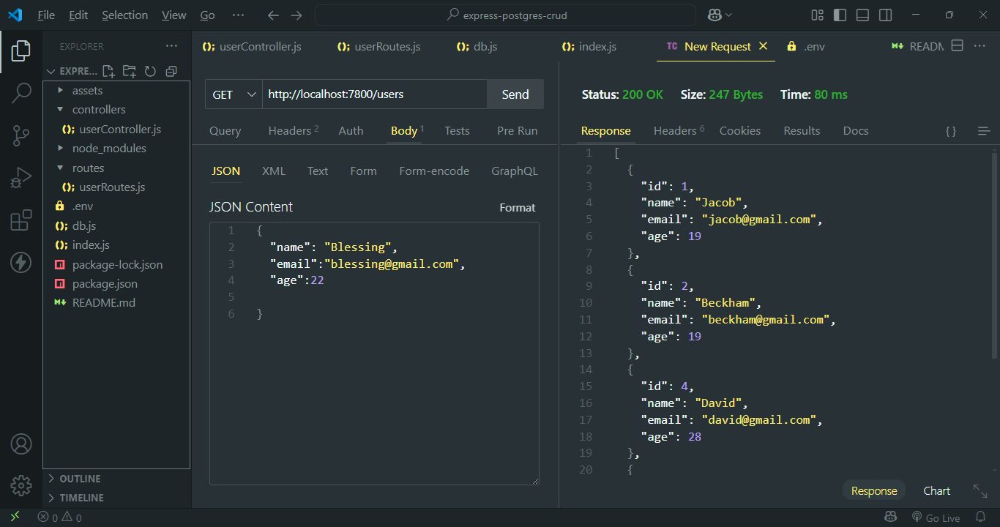
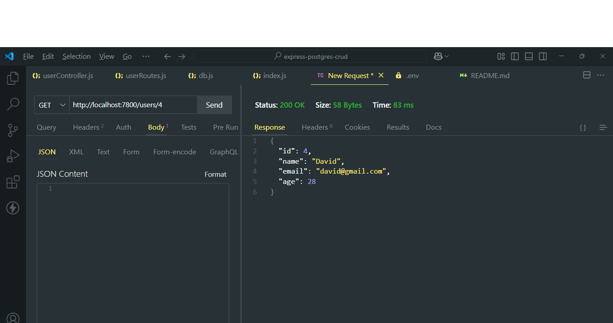
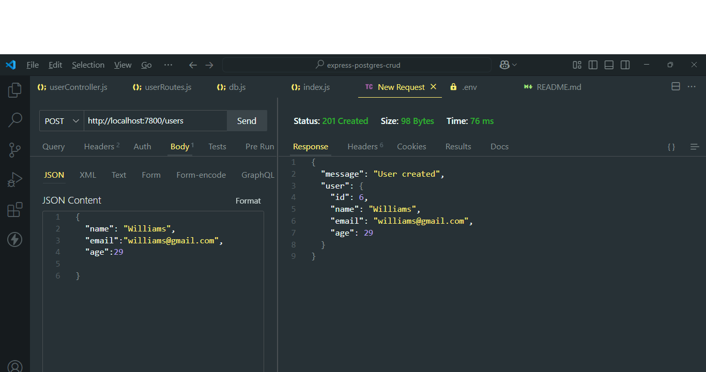
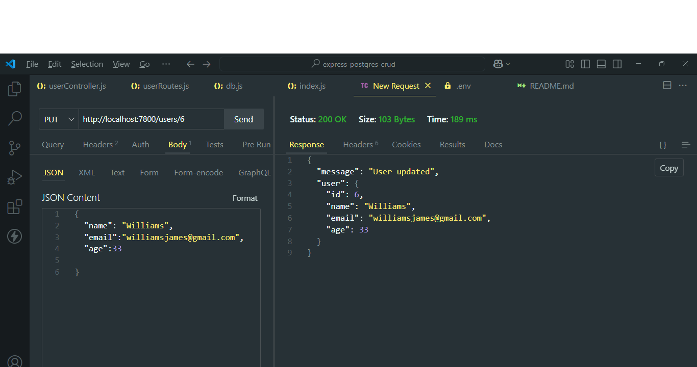
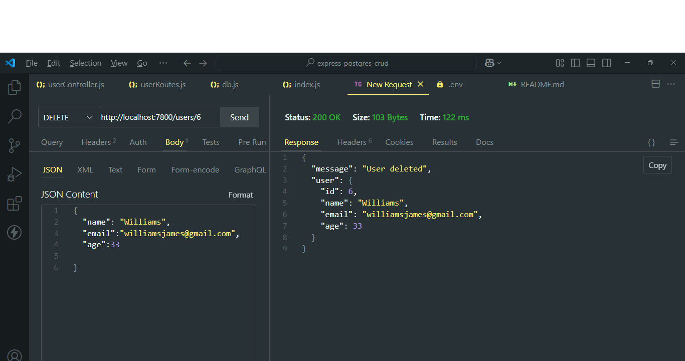

# 🛠️ Express.js + PostgreSQL CRUD API

This is a simple RESTful API built with **Express.js** that connects to a **PostgreSQL** database and performs basic **CRUD operations** on a `users` table.

---

## 📌 Description:

A simple Express.js RESTful API connected to a PostgreSQL database that performs full CRUD (Create, Read, Update, Delete) operations on a users table. Built as part of a mini project assessment under the 3MTT x Darey.io training program. Includes proper routing, controller separation, PostgreSQL integration, and tested endpoints using Thunder Client.

## 📦 Project Setup

### 1. Clone the Repository

```bash
git clone https://github.com/Bennet-Ukoh/express-postgres-crud.git
cd express-postgres-crud
```

### 2. Install Dependencies

```bash
npm install
```

### 3. Create a `.env` File

Create a `.env` file in the root of the project and add your PostgreSQL database connection details:

```env
PORT=7800
PG_HOST=localhost
PG_PORT=5432
PG_USER=your_postgres_username
PG_PASSWORD=your_postgres_password
PG_DATABASE=your_database_name
```

---

## 📄 Database Setup

You need to have **PostgreSQL** installed and running.

### Create Table

Connect to your database using **pgAdmin** or the terminal, and run this SQL command:

```sql
CREATE TABLE users (
  id SERIAL PRIMARY KEY,
  name VARCHAR(100),
  email VARCHAR(100),
  age INTEGER
);
```

---

## 🚀 Run the Application

```bash
npm run dev
```

The server will start at `http://localhost:7800`.

---

## 📡 API Endpoints

| Method | Route        | Description         |
| ------ | ------------ | ------------------- |
| GET    | `/users`     | Get all users       |
| GET    | `/users/:id` | Get a specific user |
| POST   | `/users`     | Create a new user   |
| PUT    | `/users/:id` | Update a user       |
| DELETE | `/users/:id` | Delete a user       |

---

## ✅ Thunder Client Test Screenshots

Below are screenshots showing successful tests of all routes using **Thunder Client**:

- 
- 
- 
- 
- 

---

## 📁 Project Structure

```
express-postgres-crud/
├── controllers/
│   └── userController.js
├── routes/
│   └── userRoutes.js
├── assets/
│   ├── get-all-users.png
│   ├── get-specific-user.png
│   ├── create-new-user.png
│   ├── update-user.png
│   └── delete-user.png
├── db.js
├── index.js
├── .env
├── package.json
└── README.md
```

---

## ✅ Requirements Met

✔️ Express.js server
✔️ PostgreSQL database connection
✔️ All CRUD operations implemented
✔️ Basic error handling
✔️ Thunder Client tests completed

---

## 🙌 Acknowledgment

Special thanks to **3MTT x Darey.io** for the opportunity and support throughout this project journey.

---

## 👨‍💻 Author

Created by \[Bennet Ukoh]
